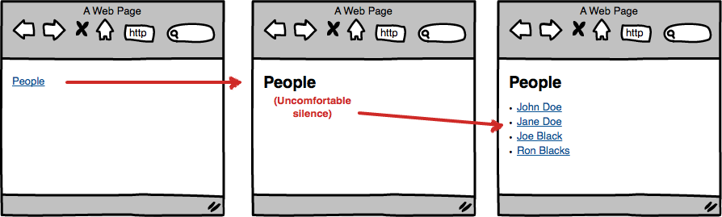
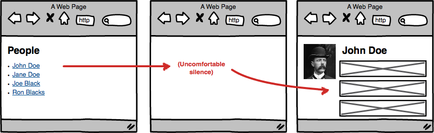

# angular-optimistic-cache

> Optimistically use cached data before a request finishes.

[](https://travis-ci.org/rubenv/angular-optimistic-cache)

## The problem
Usually you have something like this in your Angular.JS application:

```js
angular.module('myApp').controller('PeopleCtrl', function ($scope, $http) {
    $http.get('/api/people').then(function (result) {
        $scope.people = result.data;
    });
});
```

```html
<ul>
    <li ng-repeat="person in people">{{person.name}}</li>
</ul>
```

This simple example is a page that will fetch a list of people from the backend and shows it on a page.

Unfortunately, it suffers from the "uncomfortable silence". Here's a diagram to explain:



When you arrive on the page, it'll first show a blank page. After some time, this gets swapped with the data. Your app feels fast because navigation between screens is instant, but it feels jarring.

This is especially annoying when switching back-and-forth between pages, as it happens every time.

A similar thing happens when going from the list to a detail page:



Isn't it a bit strange that you know the name of the person on which the user clicked, but upon navigation that suddenly gets lost, forcing us to wait until all the info is loaded? Why not start out with showing the name while the rest of the data loads?

The `angular-optimistic-cache` module is a very lightweight module to add some of that to your application. It's probably the least intrustive way to avoid uncomfortable silences.

## Usage
Add angular-optimistic-cache to your project:

```
bower install --save angular-optimistic-cache
```

Add it to your HTML file:

```html
<script src="bower_components/angular-optimistic-cache/dist/angular-optimistic-cache.min.js"></script>
```

Reference it as a dependency for your app module:

```js
angular.module('myApp', ['rt.optimisticcache']);
```

Use it:

```js
// TODO
```

## License 

    (The MIT License)

    Copyright (C) 2014 by Ruben Vermeersch <ruben@rocketeer.be>

    Permission is hereby granted, free of charge, to any person obtaining a copy
    of this software and associated documentation files (the "Software"), to deal
    in the Software without restriction, including without limitation the rights
    to use, copy, modify, merge, publish, distribute, sublicense, and/or sell
    copies of the Software, and to permit persons to whom the Software is
    furnished to do so, subject to the following conditions:

    The above copyright notice and this permission notice shall be included in
    all copies or substantial portions of the Software.

    THE SOFTWARE IS PROVIDED "AS IS", WITHOUT WARRANTY OF ANY KIND, EXPRESS OR
    IMPLIED, INCLUDING BUT NOT LIMITED TO THE WARRANTIES OF MERCHANTABILITY,
    FITNESS FOR A PARTICULAR PURPOSE AND NONINFRINGEMENT. IN NO EVENT SHALL THE
    AUTHORS OR COPYRIGHT HOLDERS BE LIABLE FOR ANY CLAIM, DAMAGES OR OTHER
    LIABILITY, WHETHER IN AN ACTION OF CONTRACT, TORT OR OTHERWISE, ARISING FROM,
    OUT OF OR IN CONNECTION WITH THE SOFTWARE OR THE USE OR OTHER DEALINGS IN
    THE SOFTWARE.
